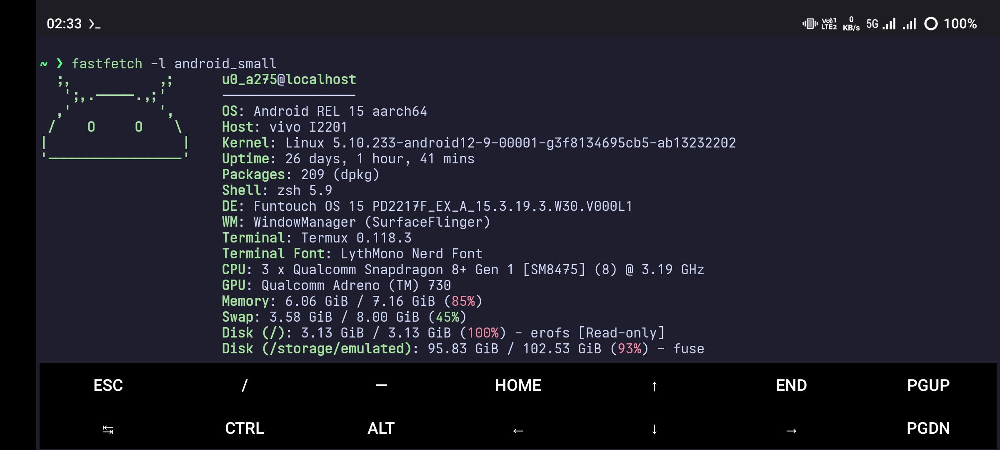

# Termux Dots

These are the config files for my termux environment.



## installation

Make sure to have [termux:api](https://f-droid.org/packages/com.termux.api/) installed.

```sh
git clone https://github.com/DemonKingSwarn/termux-dots ~/.dots
cd ~/.dots
./install.sh
```
